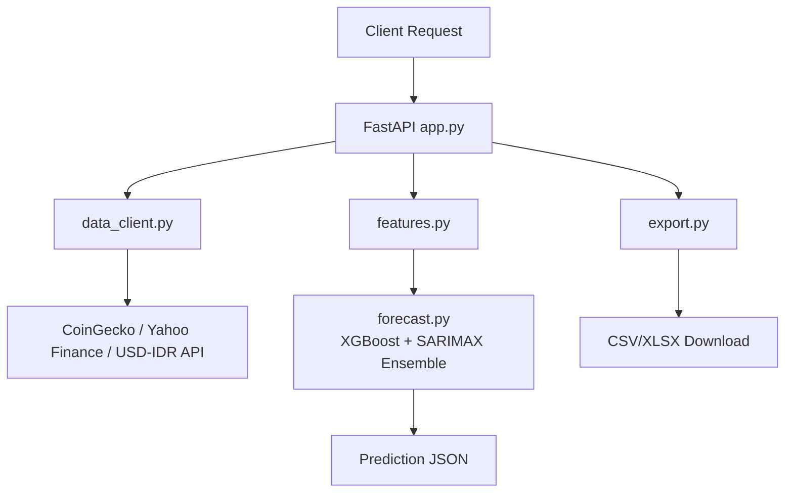

# 🚀 Fun Forecasting


Multi-asset forecasting API for crypto (CoinGecko) and Indonesian stocks (Yahoo Finance), with USD/IDR support, XGBoost + SARIMAX ensemble forecasting, optional GPU acceleration, and CSV/XLSX export.

## 📋 Table of Contents
- [Features](#-features)
- [How it works](#-how-it-works)
- [System Requirements](#-system-requirements)
- [Installation](#️-installation)
- [API Keys Setup](#-api-keys-setup)
- [Quick Start](#-quick-start)
- [API Endpoints](#-api-endpoints)
- [Supported Assets](#-supported-assets)
- [Currency Support](#-currency-support)
- [GPU Acceleration](#️-gpu-acceleration)
- [Export](#-export)
- [Docker](#-docker)
- [Project Structure](#-project-structure)
- [Disclaimer](#️-disclaimer)

## 🚀 Features
- 🪙 Crypto forecasting (`funtoken`, `bitcoin`, `ethereum`, etc.)
- 📈 Indonesian stock forecasting (`GOTO.JK`, `BBCA.JK`, `TLKM.JK`, etc.)
- 💱 USD + IDR currency support with live USD→IDR fallback conversion
- 🧠 Feature engineering: returns, volatility, momentum, RSI, MACD, Bollinger Bands
- 🔗 BTC/ETH exogenous features for crypto models
- �� Ensemble forecasting: Optuna-tuned XGBoost + SARIMAX
- 🖥️ Optional GPU acceleration with automatic fallback to CPU
- 📤 Export forecast outputs to CSV and formatted Excel (`.xlsx`)
- 🌐 FastAPI service with `/health`, `/price/live`, `/predict`, `/assets`, `/export`

## 🧠 How it works


## 📦 System Requirements
- Python 3.10+
- RAM: minimum 4GB, recommended 8GB+
- GPU: Optional (NVIDIA CUDA 11.8+ with cuDNN for acceleration)
- OS: Windows / macOS / Linux

## ⚙️ Installation
```bash
git clone https://github.com/wecrazy/fun-forecasting.git
cd fun-forecasting
python -m venv .venv
source .venv/bin/activate  # Windows: .venv\\Scripts\\activate
pip install -r requirements.txt
cp .env.example .env
```

## 🔑 API Keys Setup
Edit `.env`:
```env
COINGECKO_API_KEY=your_coingecko_demo_key_here
COINMARKETCAP_API_KEY=your_coinmarketcap_key_here
```

## 🏃 Quick Start
```bash
uvicorn app:app --reload --host 0.0.0.0 --port 8000
```
Open docs: `http://localhost:8000/docs`

## 📡 API Endpoints
| Method | Endpoint | Description |
|---|---|---|
| GET | `/health` | Health check |
| GET | `/assets` | List predefined supported assets |
| GET | `/price/live?asset=funtoken&currency=usd` | Live price with USD + IDR values |
| GET | `/predict?asset=funtoken&currency=usd&days=7&optuna_trials=60` | Forecast prices |
| GET | `/export?asset=funtoken&currency=usd&days=7&format=csv` | Download forecast report |

## 📊 Supported Assets
### Crypto (CoinGecko IDs)
| ID | Name |
|---|---|
| funtoken | FUNToken |
| bitcoin | Bitcoin |
| ethereum | Ethereum |
| binancecoin | BNB |
| solana | Solana |

### Stocks (Yahoo Finance)
| Ticker | Name |
|---|---|
| GOTO.JK | Gojek Tokopedia |
| BBCA.JK | Bank Central Asia |
| TLKM.JK | Telkom Indonesia |
| BBRI.JK | Bank Rakyat Indonesia |
| ASII.JK | Astra International |

## 💱 Currency Support
- Supported currencies: `usd`, `idr`
- Crypto can be pulled directly in USD/IDR via CoinGecko
- USD↔IDR conversion uses `https://open.er-api.com/v6/latest/USD`
- Fallback conversion: `1 USD = 16,000 IDR`
- `.JK` stocks are IDR-native and converted to USD only when needed

## 🖥️ GPU Acceleration
- Controlled via `USE_GPU=auto|true|false` in `.env`
- Auto mode tries PyTorch CUDA detection and fallback checks
- XGBoost uses `gpu_hist` when possible; otherwise falls back to `hist`

## 📤 Export
- `format=csv` returns forecast rows
- `format=xlsx` returns workbook with:
  - Summary
  - Predictions
  - Historical (last 90 days)
  - Diagnostics

## 🐳 Docker
```bash
docker build -t fun-forecasting .
docker run --rm -p 8000:8000 --env-file .env fun-forecasting
```

## 📁 Project Structure
```text
fun-forecasting/
├── app.py
├── config.py
├── data_client.py
├── features.py
├── forecast.py
├── gpu_utils.py
├── export.py
├── requirements.txt
├── .env.example
├── .gitignore
├── Dockerfile
└── README.md
```

## ⚠️ Disclaimer
This project is for education and research only. Forecasts are uncertain and must not be treated as financial advice.
